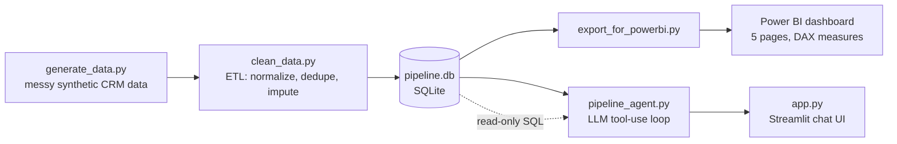

# AI Sales Pipeline

An end-to-end sales-ops analytics project: messy synthetic CRM data in, a
clean SQLite warehouse, a Power BI dashboard, and a natural-language Q&A
agent out — built to practice the full path from raw data to something an
actual business user can query in plain English.

**🔗 Live demo:** [e2eew2hyaaopgdvfehxz2c.streamlit.app](https://e2eew2hyaaopgdvfehxz2c.streamlit.app/)

---

## What this project shows

| Layer | What it demonstrates |
|---|---|
| Data generation & cleaning | Realistic ETL: inconsistent formats, duplicates, missing values, deterministic imputation |
| SQL analysis | Sales-ops metrics (win rate, sales cycle, stalled deals, rep performance) written and cross-verified against a live database |
| Power BI dashboard | DAX measures, relationship modeling, and debugging a real broken data model (inactive relationships, aggregation bugs) |
| Agentic AI layer | An LLM tool-use loop, from a manual first-principles implementation up to a safety-hardened, deployed app — including the bugs found and fixed along the way |

## Architecture



## The pipeline

```bash
python src/generate_data.py      # -> data/raw/{leads,reps,activities}.csv
python src/clean_data.py         # -> data/pipeline.db (SQLite)
python src/export_for_powerbi.py # -> data/clean/{leads,reps,activities}.csv
```

`data/` is git-ignored and fully reproducible — re-run the pipeline (or just
launch the app, which does this automatically; see below) to regenerate it.
`generate_data.py` seeds `random`, so the output is deterministic.

Full data model, cleaning logic, and deliberate messiness are documented in
[`PROJECT_PLAN.md`](PROJECT_PLAN.md).

## Power BI dashboard

Five pages — Overview, Lead Sources, Rep Performance, Stalled Deals, Member
vs Non-Member — built on `data/clean/*.csv`, with every headline number
cross-checked against `src/analysis_queries.sql` run directly on
`pipeline.db`. See `PROJECT_PLAN.md` for the DAX measures and relationships.

## The agentic Q&A layer

The most interesting part: a chat agent that answers plain-English
questions about the pipeline by writing and running real SQL — not by
guessing.

**How it works:** an OpenAI model (`gpt-4o`) is given one tool,
`query_database`. On each turn it either answers directly or asks to run a
SQL query; the app executes it for real and feeds the result back, looping
until the model has enough to answer
([`src/pipeline_agent.py`](src/pipeline_agent.py)).

**Safety, not just prompting:** nothing here relies on the model
*choosing* to behave. The database connection is opened in SQLite's
read-only URI mode — writes are refused at the database-engine level,
regardless of what SQL text the model generates — with a fast keyword
check in front of it for a clear error message instead of a low-level one.
Verified directly (bypassing the LLM entirely) rather than just trusted:
see the "Known limitations" section of `PROJECT_PLAN.md` for the full
write-up.

**Built incrementally, on purpose:** `src/agent_step1.py` through
`agent_step4.py` are the actual learning progression — starting from a
plain API call with no tools (to see the baseline hallucination problem),
through a single manual tool round-trip, to a real agentic loop, to the
safety guardrails above. Kept in the repo deliberately as a visible record
of the build, not just the finished result.

**Real bugs, found and fixed:** while testing, the agent confidently
guessed a wrong stage label (`'Closed Won'` instead of the real `'Won'`)
and reported zero results as fact; it also applied the wrong win-rate
formula (dividing by all leads instead of closed deals only) before the
tool description was corrected to ground both facts explicitly. Both are
documented in `PROJECT_PLAN.md`, along with two gaps that are *not* fixed
(tie-breaking, and unflagged predictive extrapolation) — left as an honest
record of where a first pass at an LLM agent over real data breaks down,
and why.

### Run it locally

```bash
pip install -r requirements.txt
cp .env.example .env   # then fill in your real OPENAI_API_KEY
streamlit run app.py
```

### Deployment

Deployed on **Streamlit Community Cloud**, connected directly to this
GitHub repo — no Docker/manual server setup. `data/pipeline.db` is
git-ignored, so a fresh deploy has no data on first boot;
`ensure_database_exists()` in `pipeline_agent.py` detects that and runs the
generate → clean pipeline automatically on first load, deterministically
(same seeded data every time).

## Tech stack

Python · pandas · SQLite · Power BI (DAX) · OpenAI API (`gpt-4o`, function
calling) · Streamlit

## Project structure

```
src/
  generate_data.py       # synthetic messy CRM data
  clean_data.py           # ETL -> pipeline.db
  export_for_powerbi.py   # -> CSVs for Power BI
  analysis_queries.sql    # 7 standard sales-ops queries
  pipeline_agent.py        # shared agent logic (tool, safety, loop)
  agent_step1.py..step4.py # the incremental learning build of the agent
app.py                    # Streamlit chat UI
PROJECT_PLAN.md            # full data model, cleaning logic, known limitations
```
